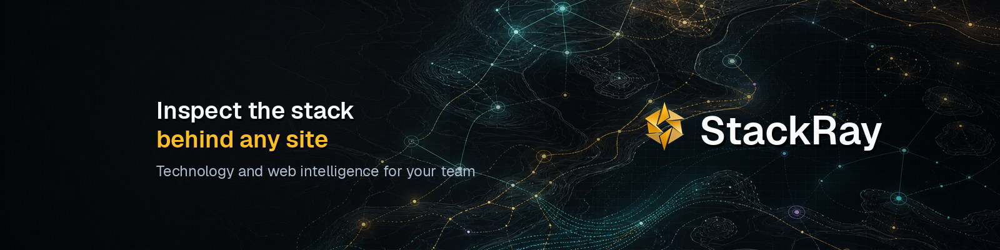
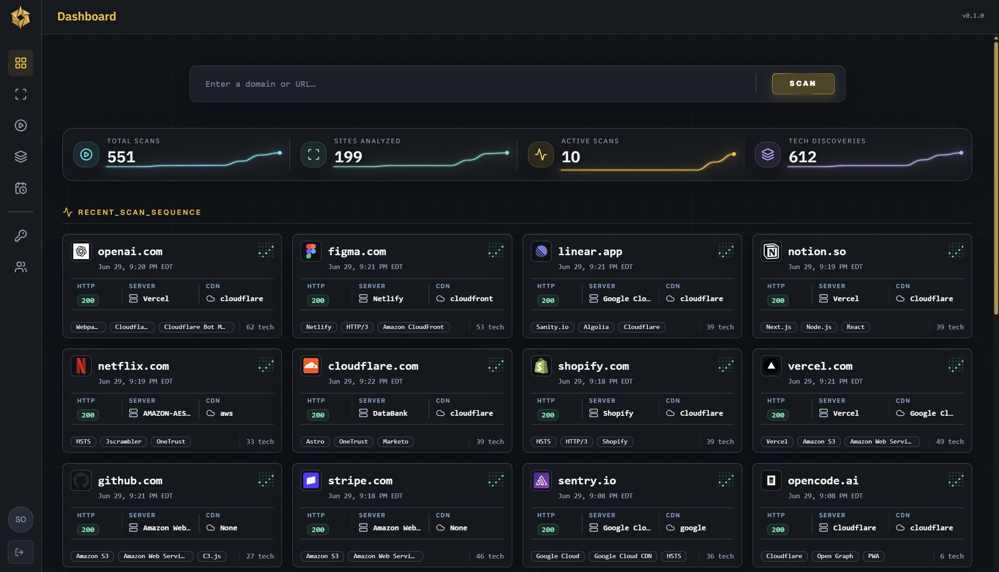

<p align="center">
  
</p>

<p align="center">
  <a href="https://railway.com/deploy/stackray"></a>
</p>

<p align="center">
  <a href="https://github.com/CarlosCommits/stackray/actions/workflows/ci.yml"></a>
  <a href="https://github.com/CarlosCommits/stackray/blob/main/LICENSE"></a>
</p>

# Stackray - Inspect the stack behind any site

Stackray is a self-hosted site intelligence app for scanning domains and URLs, detecting the technologies behind them, and keeping a searchable record of what changed over time.

Give Stackray a target and it runs a multi-phase scan across HTTP probing, browser rendering, DNS, subdomain discovery, IP intelligence, screenshots, Nuclei templates, and technology enrichment. The result is a practical view of what a site is built with, how it responds, and what public signals are visible around it.

Try the live demo at [stackray.app](https://stackray.app).

<p align="center">
  
</p>

## Table of Contents

- [What You Can Do](#what-you-can-do)
- [Deploy On Railway](#deploy-on-railway)
- [Local Development](#local-development)
- [Documentation](#documentation)
- [Built On ProjectDiscovery](#built-on-projectdiscovery)
- [Responsible Use](#responsible-use)
- [License](#license)

## What You Can Do

### Detect

- Detect frameworks, CMSs, ecommerce platforms, analytics, CDNs, WAFs, hosting providers, and other web technologies.
- Capture screenshots, favicons, page titles, response metadata, redirects, TLS details, DNS records, and server fingerprints.
- Enrich targets with passive subdomain discovery, IP/ASN context, DNS service evidence, and OSINT-style public signals.
- Run Nuclei-backed checks for templated DNS, HTTP, and exposure findings.

### Workflow

- Compare technology stacks across multiple sites.
- Schedule recurring scans.
- Review scan history from the web UI and consume progress/results through the HTTP/JSON API and SSE event stream.

### Collaboration

- Invite teammates to your deployed instance and create user accounts for them.
- Create API keys for integrations, automation, or AI agents that need to queue scans and interact with Stackray data.

## Deploy On Railway

[](https://railway.com/deploy/stackray)

Stackray is built to be easy to self-host on Railway. The one-click template provisions the web app, scanner workers, Postgres database, and S3-compatible storage in one flow, so you can go from a fresh Railway project to a working Stackray instance without hand-wiring each service yourself.

After deploying, open the `Stackray-website` service in Railway. This is the Next.js service that runs Stackray. Go to `Settings` -> `Networking` -> `Public Networking` and click `Generate Domain` to get the public Stackray URL.

Stackray's Railway layout uses separate services for:

- `Stackray-website` - the Next.js app, API routes, auth, and release/update notices
- `worker-http` - HTTP probing and technology detection
- `worker-intel` - subdomain, DNS, Nuclei, IP, and scan finalization work
- `worker-browser` - browser rendering, screenshots, and runtime technology detection
- `postgres` - app data, scan history, auth records, and Graphile Worker jobs
- `s3` - screenshot and scan artifact storage

See [docs/railway-template-readme.md](docs/railway-template-readme.md) for the template copy and [docs/railway-updates.md](docs/railway-updates.md) for updating an existing deployment.

## Local Development

Stackray uses Node `24.x`, `pnpm@10.26.1`, and Docker for scanner dependencies. Make sure Docker is installed and running before starting the local stack.

```bash
pnpm install
```

If `pnpm` is not available locally, enable it through Corepack and pin the matching version:

```bash
corepack enable && corepack prepare pnpm@10.26.1 --activate
```

The easiest local setup keeps the Next.js dev server on the host and runs scan dependencies in Docker:

- Postgres stores app data and Graphile Worker jobs.
- MinIO provides a local S3-compatible screenshot bucket.
- Worker containers provide scanner binaries, Nuclei templates, and browser/screenshot runtime dependencies.

Initialize the local environment:

```bash
pnpm dev:init
```

This creates `.env.local` from `.env.local.example` if needed, starts local infrastructure, applies database migrations, and creates a local admin user:

- email: `admin@stackray.local`
- password: `StackrayDev123!`

Start the app and workers:

```bash
pnpm dev:local
```

Useful local commands:

```bash
pnpm dev:infra        # start Postgres, MinIO, and bucket initialization
pnpm dev:local:down   # stop local Docker services, keeping data volumes
pnpm dev:local:wipe   # stop local Docker services and delete local data volumes
pnpm dev:infra:logs   # follow local service logs
```

`pnpm dev:local` prints the app, Postgres, MinIO API, and MinIO console URLs after it chooses available ports. The first local stack normally uses app `http://localhost:3000`, Postgres `127.0.0.1:5432`, MinIO API `127.0.0.1:9000`, and MinIO console `127.0.0.1:9001`.

## Documentation

- [CONTRIBUTING.md](CONTRIBUTING.md) - local setup, scripts, schema changes, and contribution workflow
- [docs/architecture.md](docs/architecture.md) - service boundaries, deployment model, and worker architecture
- [docs/pages.md](docs/pages.md) - web UI page inventory and behavior
- [docs/technology-detection.md](docs/technology-detection.md) - scanner detection rules and update workflow
- [docs/releases.md](docs/releases.md) - release-please, versioning, and GitHub Release publishing
- [docs/railway-updates.md](docs/railway-updates.md) - updating self-hosted Railway deployments

## Built On ProjectDiscovery

Stackray is built on top of excellent open source security tooling from [ProjectDiscovery](https://projectdiscovery.io/), especially:

- [httpx](https://github.com/projectdiscovery/httpx) for fast HTTP probing, response metadata, TLS/DNS fields, screenshots, and technology detection
- [nuclei](https://github.com/projectdiscovery/nuclei) for template-driven checks across HTTP, DNS, SSL, and related protocols
- [subfinder](https://github.com/projectdiscovery/subfinder) for passive subdomain discovery

Big thanks to the ProjectDiscovery team and community for making these tools available.

## Responsible Use

Stackray is built for authorized asset inventory, security research, and site intelligence. Use it responsibly and follow applicable laws, terms of service, and rate limits. Do not use Stackray for abusive traffic, unauthorized vulnerability testing, or service disruption. You are responsible for how you deploy and use Stackray.

## License

Stackray is available under the [MIT License](LICENSE).
